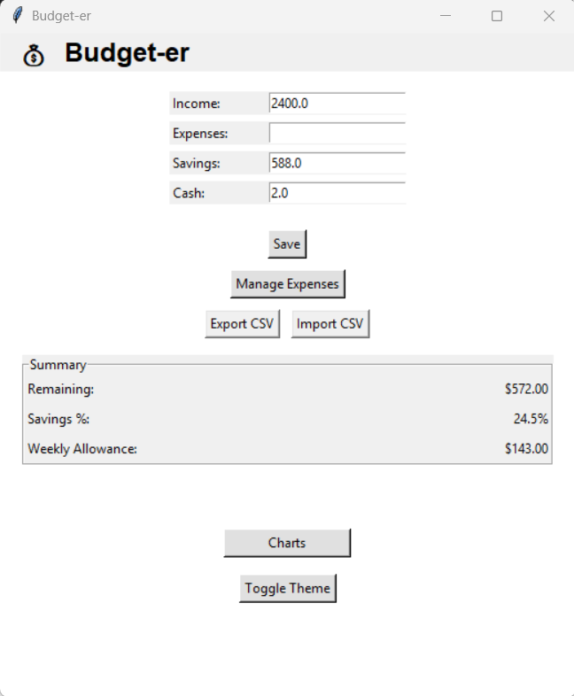
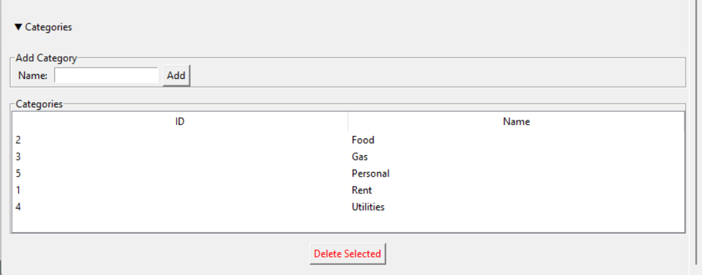
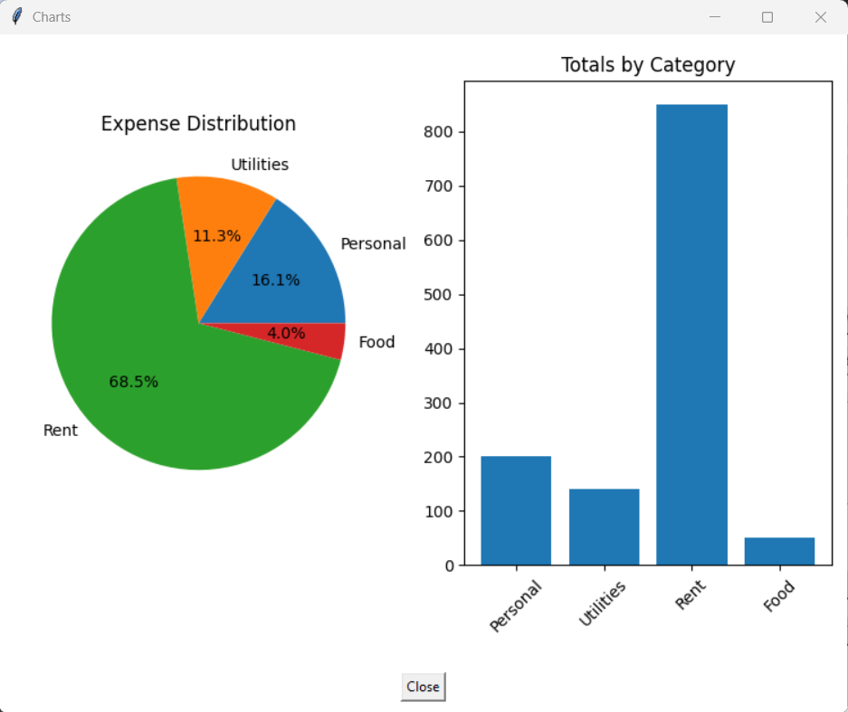

# 💰 Budget-er  
A clean, modern personal budgeting app built with Python & Tkinter.  
Track your income, expenses, categories, and visualize your spending with built-in charts.

Budget-er is lightweight, fast, and designed for everyday users who want a simple money manager without subscriptions or cloud accounts.

---

## ✨ Features

### ✅ Dashboard Overview  
- Enter income, savings goals, and available cash  
- Automatic remaining balance calculation  
- Weekly allowance estimator  
- Overspending warnings  
- Light/Dark theme toggle

### ✅ Expense Manager  
- Add expenses with category selection  
- Scrollable, clean UI  
- Edit & delete entries  
- Automatic totals and summaries  
- CSV import/export support  
- Category manager (add/delete categories)

### 📊 Built-In Charts  
- Pie chart of spending distribution  
- Bar chart comparing category totals  
- Updates instantly as you add expenses

### 🗂️ Category Manager  
- Create your own categories (e.g., Rent, Food, Internet)  
- Delete unused categories  
- Automatically updates dropdown menus  

### 🖥️ Installer-Ready  
- Works as a standalone Python app  
- Fully compatible with PyInstaller for EXE builds

---

## 📸 Screenshots

### 🏠 Dashboard  


### 💵 Expense Manager  


### 🗂️ Category Manager  


### 📊 Charts Window  


---

## 🚀 Installation

### **Option 1 — Run from Source**
1. Install Python 3.11+
2. Install required packages:
   ```bash
   pip install matplotlib
